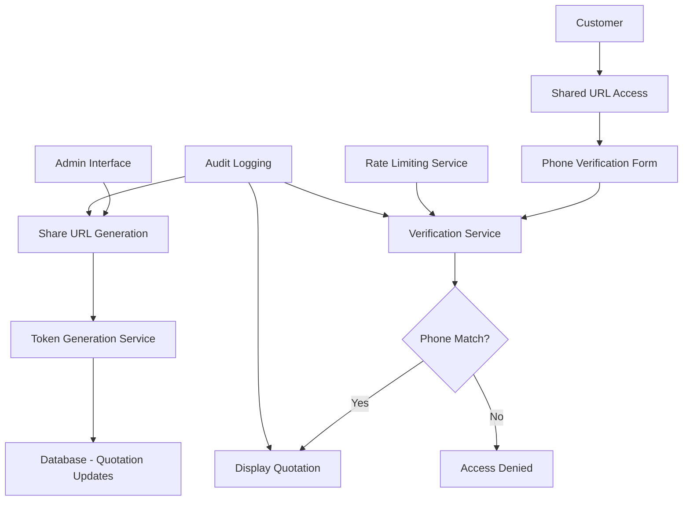

# Design Document

## Overview

The secure quotation sharing feature enables administrators to generate unique, secure URLs for quotations that can only be accessed by the intended customer through phone number verification. The system uses a token-based approach combined with phone number verification to ensure secure access while maintaining a seamless user experience.

## Architecture

### High-Level Architecture



### System Components

1. **URL Generation Service**: Creates secure, unique tokens for quotations
2. **Phone Verification Service**: Validates customer phone number input
3. **Customer Quotation View**: Public-facing quotation display
4. **Rate Limiting Service**: Prevents brute force attacks
5. **Audit Logging Service**: Tracks all sharing and access activities

## Components and Interfaces

### 1. Database Schema Extensions

#### Quotation Model Updates
```typescript
interface IQuotation {
  // ... existing fields
  sharing: {
    isShared: boolean;
    shareToken: string | null;
    sharedAt: Date | null;
    sharedBy: string | null; // User ID who shared
    accessCount: number;
    lastAccessedAt: Date | null;
  };
}
```

#### New Collections

**QuotationAccess Collection**
```typescript
interface IQuotationAccess {
  quotationId: string;
  ipAddress: string;
  userAgent: string;
  accessedAt: Date;
  verificationAttempts: number;
  successful: boolean;
}
```

**ShareAuditLog Collection**
```typescript
interface IShareAuditLog {
  quotationId: string;
  action: 'shared' | 'accessed' | 'revoked' | 'verification_failed';
  userId?: string; // For admin actions
  ipAddress: string;
  userAgent: string;
  metadata?: Record<string, any>;
  timestamp: Date;
}
```

### 2. API Endpoints

#### Admin Endpoints

**POST /api/quotations/[id]/share**
- Generates or retrieves existing share token
- Updates quotation sharing status
- Returns shareable URL

**DELETE /api/quotations/[id]/share**
- Revokes sharing access
- Invalidates existing token
- Updates quotation sharing status

**GET /api/quotations/[id]/share/status**
- Returns current sharing status
- Includes access statistics

#### Public Endpoints

**GET /api/quotations/shared/[token]**
- Validates token and returns verification form
- Implements rate limiting

**POST /api/quotations/shared/[token]/verify**
- Validates phone number digits
- Returns quotation data on success
- Logs access attempts

### 3. Frontend Components

#### Admin Components

**ShareQuotationButton Component**
```typescript
interface ShareQuotationButtonProps {
  quotationId: string;
  isShared: boolean;
  onShareStatusChange: (shared: boolean) => void;
}
```

**ShareStatusIndicator Component**
```typescript
interface ShareStatusIndicatorProps {
  quotation: QuotationWithSharing;
  showDetails?: boolean;
}
```

#### Customer Components

**PhoneVerificationForm Component**
```typescript
interface PhoneVerificationFormProps {
  token: string;
  onVerificationSuccess: (quotation: QuotationData) => void;
  onVerificationError: (error: string) => void;
}
```

**CustomerQuotationView Component**
```typescript
interface CustomerQuotationViewProps {
  quotation: QuotationData;
  isPublicView: boolean;
}
```

## Data Models

### Extended Quotation Type
```typescript
interface QuotationWithSharing extends QuotationListItem {
  sharing: {
    isShared: boolean;
    shareToken: string | null;
    sharedAt: string | null;
    sharedBy: string | null;
    accessCount: number;
    lastAccessedAt: string | null;
  };
}
```

### Verification Request/Response
```typescript
interface VerificationRequest {
  phoneDigits: string; // Last 4 digits
}

interface VerificationResponse {
  success: boolean;
  quotation?: QuotationData;
  error?: string;
  remainingAttempts?: number;
}
```

### Share URL Response
```typescript
interface ShareUrlResponse {
  success: boolean;
  shareUrl: string;
  token: string;
  expiresAt?: string; // Future enhancement
}
```

## Security Considerations

### Token Generation
- Use cryptographically secure random tokens (32+ characters)
- Tokens should be URL-safe and non-guessable
- Store hashed versions in database for additional security

### Rate Limiting
- Implement per-IP rate limiting for verification attempts
- Maximum 5 attempts per IP per hour
- Exponential backoff for repeated failures

### Phone Number Validation
- Extract and compare only the last 4 digits
- Case-insensitive comparison
- Strip all non-numeric characters before comparison

### Access Control
- Validate token existence and quotation association
- Ensure quotation has sharing enabled
- Check for revoked access

## Error Handling

### Client-Side Error States
1. **Invalid Token**: "This link is no longer valid"
2. **Phone Verification Failed**: "Phone number doesn't match our records"
3. **Rate Limited**: "Too many attempts. Please try again later"
4. **Quotation Not Found**: "Quotation not found"
5. **Network Errors**: "Unable to connect. Please try again"

### Server-Side Error Responses
```typescript
interface ErrorResponse {
  error: string;
  code: 'INVALID_TOKEN' | 'VERIFICATION_FAILED' | 'RATE_LIMITED' | 'NOT_FOUND' | 'SERVER_ERROR';
  details?: string;
  remainingAttempts?: number;
}
```

## Testing Strategy

### Unit Tests
1. **Token Generation Service**
   - Unique token generation
   - Token validation
   - Hash comparison

2. **Phone Verification Service**
   - Digit extraction and comparison
   - Input validation
   - Rate limiting logic

3. **Database Operations**
   - Quotation sharing updates
   - Access logging
   - Audit trail creation

### Integration Tests
1. **Share URL Generation Flow**
   - Admin generates share URL
   - Database updates correctly
   - URL format validation

2. **Customer Access Flow**
   - Token validation
   - Phone verification
   - Quotation display
   - Access logging

3. **Security Tests**
   - Rate limiting enforcement
   - Invalid token handling
   - Unauthorized access prevention

### End-to-End Tests
1. **Complete Sharing Workflow**
   - Admin shares quotation
   - Customer accesses and verifies
   - Quotation displays correctly

2. **Error Scenarios**
   - Invalid phone verification
   - Revoked access attempts
   - Rate limiting triggers

## Performance Considerations

### Database Optimization
- Index on shareToken field for fast lookups
- Index on quotationId + timestamp for audit queries
- Consider TTL indexes for cleanup of old access logs

### Caching Strategy
- Cache quotation data for shared quotations
- Cache rate limiting counters in Redis/memory
- Implement CDN caching for static assets

### Monitoring and Metrics
- Track share URL generation rates
- Monitor verification success/failure rates
- Alert on unusual access patterns
- Performance metrics for verification response times

## Future Enhancements

### Potential Features
1. **Expiration Dates**: Time-limited access to shared quotations
2. **Access Notifications**: Email/SMS notifications when quotation is accessed
3. **Multiple Verification Methods**: Email verification as alternative
4. **Branded Customer View**: Customizable quotation display for customers
5. **Download Options**: PDF generation for customer quotations